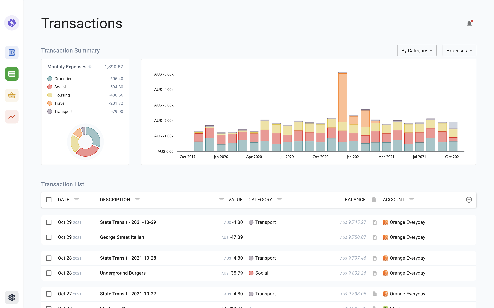

# TopHat

TopHat is an offline-first personal finances app. It is designed to let users manage their finances across multiple currencies, in a privacy-preserving way.

### What is it, technically speaking?

It's a web app served by GitHub Pages, with no backend service.

The frontend is a Single Page App bootstrapped with Create-React-App, built using Typescript/React/Redux and some other common libraries (primarily [Victory Charts](https://formidable.com/open-source/victory/) and [Material-UI](https://mui.com/)). It uses a Service Worker for offline behaviour, and IndexedDB (via dexie.js) for storage.

### Why have you done this?

I know, another personal finance app.

I wanted to track my expenses in a lightweight way, without doing something crazy like giving a 3rd party the passwords to my bank accounts. After looking around, I found that I wanted three main things:

-   Privacy: I don't want my credentials or account details to be sold or used for ad targeting, or subject to the questionable infosec standards of the latest hip FinTech startup. This also rules out direct connections to most banks, so I need a smooth and automated experience for uploading bank statements, to save the manual gruntwork.
-   Multi-Currency Support: I hold money in multiple currencies, and need to be able to track them over time. This is strangely uncommon in the world of personal finance apps.
-   Transaction Tracking: I don't need a full YNAB-style budgeting workflow, but I do want to be able to track how much I'm spending on bills/recreation/travel over time, and see how the balance between them is changing.

I couldn't find anything which hit all three requirements, so after many weekends of work, TopHat is now what I'm using.

### Should I use this?

Probably not! The goals of TopHat are fairly niche interests, and there may be bugs that I'm not seeing. That said, I can at least vouch for the fact that I'm using it, and that I see no reason why I would take it down in the future. It's available publicly at [https://athenodoros.github.io/TopHat](https://athenodoros.github.io/TopHat), and it can populate itself with notional data for an easy trial.

## Potentially Asked Questions

**Why have you done this in the browser? Why not a native app?**

My feelings are basically summarised in [this XKCD](https://xkcd.com/1367/), but the short answer is that deployment, installation, and upgrades are all made extremely easy in the browser. It can be [installed as a Progressive Web App](https://support.google.com/chrome/answer/9658361), if something app-shaped is desired.

A reasonable concern might be around performance, particularly given that all data is loaded in memory while the app is open. In practice, my experience is that this isn't a major issue even with thousands of transactions, so I haven't spent time on a "more scalable" architecture.

**Does this work on mobile?**

It does not: TopHat is designed for periodic updates and inspection, rather than the daily use which would suggest a mobile interface. Mostly this is because I dislike the idea of constant monitoring of finances, but it would also be difficult to sync data between computer and mobile without a backend server.

**I found a bug/I have a cool idea/I want to say hi!**

Let me know! No promises, though, although I'll probably say hi back.
